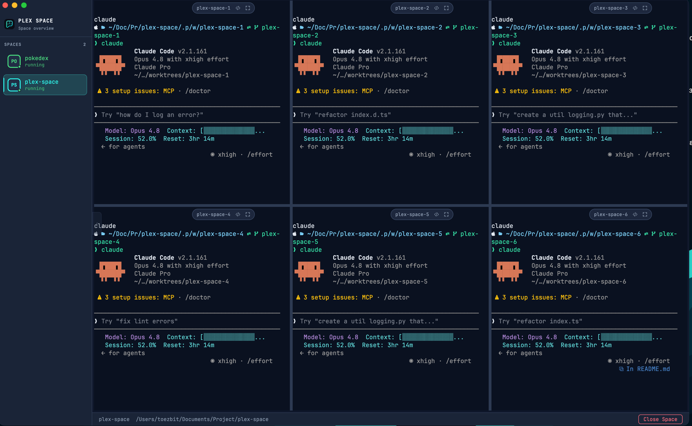

<p align="center"></p>

# Plex Space

A macOS desktop app for running AI CLI agents (Claude Code, Codex CLI) in configurable terminal grids.

Keep a list of named **Spaces**, open one to launch a grid of Terminals all running the same agent inside that Space's directory. Multiple Spaces can run concurrently in the background.

<p align="center">
  
</p>

## Download & install

Plex Space ships as a **universal macOS app** — it runs natively on both Apple Silicon and Intel Macs.

1. **Download** the latest `.dmg` from the **[Releases page](https://github.com/ToEzBit/plex-space/releases/latest)**.
2. **Open the `.dmg`** and drag **Plex Space** into your **Applications** folder.
3. **First launch — clear Gatekeeper.** This build is not yet code-signed or notarized, so macOS blocks it on first open ("Plex Space is damaged" or "can't be opened"). Clear the quarantine flag once in Terminal, then open the app normally:
   ```bash
   xattr -cr "/Applications/Plex Space.app"
   ```
   _Alternatively:_ **right-click the app → Open → Open**, or allow it under **System Settings → Privacy & Security → Open Anyway**.
4. **Install an agent.** Make sure Claude Code (`claude`) and/or Codex CLI (`codex`) is installed and on your `PATH` — Plex Space launches whichever you pick when opening a Space.

> **Platform support:** macOS only (Apple Silicon or Intel). Windows/Linux are intentionally out of scope — see [ADR-0005](docs/adr/0005-mvp-scope-boundary.md). The app relies on macOS-specific behavior (POSIX shell, APFS clonefile), so supporting them is a port, not just a new build target.

Prefer to build it yourself? See [Getting started](#getting-started).

## What is a Space?

A **Space** is a saved workspace bound to a single working directory. When you open it, you pick a **Layout** (how many panes) and an **Agent** (which CLI to run). Every pane in the layout gets its own Terminal running that agent — letting you run multiple parallel agent sessions pointed at the same codebase. A Space saves only its name and directory; the Layout and Agent are chosen fresh each time you open it.

- Open Spaces are listed in the persistent **Command center** sidebar; switching between them keeps every Terminal running warm in the background.
- Closing a Space stops its Terminals but keeps it in the list to reopen later.
- Removing a Space from the list is a separate action.

## Features

- **Command center** — a persistent sidebar that lists every Space and shows which ones are open (ring indicator); switch Spaces without leaving the active grid, collapse it to reclaim terminal width
- **Configurable layouts** — 1, 2, 3, 4, or 6 panes per Space
- **Resizable panes** — drag the boundary between adjacent panes to adjust their proportions; double-click a divider to reset (session-only, resets on reopen)
- **Per-pane git worktrees** — opt any pane into an isolated git worktree on its own branch, so that pane's agent works off the Space's branch; mix worktree and non-worktree panes in one layout, resume dirty worktrees from a picker
- **Agent selection** — choose between Claude Code (`claude`) or Codex CLI (`codex`) per session
- **Pane header actions** — open a pane's directory in VS Code, toggle a pane to fullscreen, and see its worktree branch at a glance
- **Concurrent Spaces** — multiple Spaces can run simultaneously in the background
- **Persistent list** — Spaces survive app restarts (Terminals restart fresh; no scrollback restore)

## Git worktrees

When a Space's directory is a git repository, each pane can opt into its own **worktree** — an isolated working tree on a new branch (forked from the current `HEAD`), so multiple agents can edit the same codebase in parallel without colliding. Plex Space creates the worktree itself (`git worktree add`) and runs the bare agent inside it.

- Worktrees live under `<repo>/.plex-space/worktrees/<branch>` and are kept out of `git status` via `.git/info/exclude` — no diff in your committed files.
- On **Close Space**, a clean worktree is removed and its branch force-deleted; a dirty worktree is kept so you can resume it from the picker next time. Treat worktrees as throwaway experiments — merge the winner, lose the rest.
- A fresh worktree only contains tracked files. To bring gitignored essentials (`.env`, `node_modules`, `.venv`, …) into new worktrees, list them one path per line in a `.worktreeinclude` file at the repo root; they're copied in with APFS copy-on-write clones (instant, isolated, near-zero disk).

See **ADR-0009** for the full design and trade-offs.

## Tech stack

| Layer             | Technology                |
| ----------------- | ------------------------- |
| App shell         | Electron 35               |
| Renderer          | React 19 + TypeScript     |
| Build             | electron-vite + Vite 6    |
| Terminal emulator | xterm.js (`@xterm/xterm`) |
| PTY               | node-pty                  |
| Tests             | Vitest                    |

## Requirements

- macOS (only supported platform)
- Node.js ≥ 18
- Claude Code (`claude`) and/or Codex CLI (`codex`) installed and on your `PATH`
- `git` on your `PATH` for the per-pane worktree feature (optional otherwise)
- The `code` CLI on your `PATH` to use "Open in VS Code" from a pane header (optional)

## Getting started

```bash
# Install dependencies
npm install

# Run in development mode
npm run dev

# Type-check + bundle into out/ (no installer)
npm run build

# Package a universal (Apple Silicon + Intel) .dmg into dist/
npm run dist:mac
```

## Using Plex Space

### 1. Create a Space

On first launch you'll see an empty state — click **New Space** to open the wizard:

1. **Working directory** — choose or paste the folder your agents should run in, and give the Space a name.
2. **Layout** — pick how many panes you want (1, 2, 3, 4, or 6).
3. **Agent** — pick the CLI every pane will run: **Claude Code** (`claude`) or **Codex CLI** (`codex`).
4. **Worktrees** *(only if the directory is a git repo)* — for each pane, optionally turn on an isolated git worktree and name its branch, or resume a kept worktree from the list. Leave a pane off to run it directly in the Space's directory.

Click **Launch Space** and the grid spins up — every pane gets its own terminal running the agent.

> The Layout and Agent default to whatever you used last, so the common case is just **New Space → pick a folder → Launch**.

### 2. Work in the grid

- **Switch Spaces** from the Command center sidebar — open Spaces stay running warm in the background, so switching is instant.
- **Resize panes** by dragging the divider between them; double-click a divider to reset it to equal.
- Each pane has a floating **pane header** with its branch name (for worktree panes) and buttons to **Open in VS Code** and toggle **Fullscreen**.
- **Collapse the sidebar** (the pill on its edge, or `⌘B`) to give the terminals full width.

### 3. Open, close, and remove

- **Open** an existing Space by clicking it in the sidebar — you'll re-pick a Layout and Agent, then launch.
- **Close Space** (button in the bottom status bar) stops its terminals but keeps it in the list. Clean worktrees are cleaned up; dirty ones are kept to resume later.
- **Remove** deletes the Space from your list entirely — a separate action from closing.

## Keyboard shortcuts

**Anywhere in the app**

| Shortcut | Action                              |
| -------- | ----------------------------------- |
| `⌘B`     | Toggle the Command center sidebar   |
| `Esc`    | Exit pane fullscreen                |

**In the New / Open Space wizard**

| Shortcut | Action                                            |
| -------- | ------------------------------------------------- |
| `Enter`  | Next step (never launches — that's an explicit click) |
| `←` `→`  | Cycle the choice on the Layout / Agent step       |
| `Esc`    | Cancel and close the wizard                       |

> Inside a pane, all other keystrokes go straight to the terminal and its agent — Plex Space stays out of the way.

## Development commands

```bash
npm run dev          # Start dev server with hot-reload
npm run build        # Type-check + bundle renderer/main into out/
npm run dist:mac     # Build + package a universal (arm64 + x64) .dmg into dist/
npm run test         # Run unit tests (Vitest)
npm run typecheck    # Type-check main and renderer
npm run lint         # ESLint
npm run format       # Prettier
```

## Project structure

```
src/
  main/        Electron main process — IPC, PTY lifecycle (spacePool, terminalRegistry),
               launch planning (launchPlan, resolvePanes), worktree management, spaceStore
  preload/     Context bridge between main and renderer
  renderer/    React UI — App, Sidebar (Command center), NewSpaceWizard, PaneTerminal,
               PaneHeader, layout components + resizable-divider logic
  shared/      Types shared across processes (layout, worktree, spaceRuntime)
docs/
  adr/         Architecture Decision Records
  agents/      Agent-skill guides (issue tracker, triage labels, domain docs)
  design-system.md
CONTEXT.md     Domain glossary — canonical names for Space, Command center, Layout, Pane, Terminal, Agent, Worktree
```

## Architecture decisions

Key decisions are documented as ADRs in `docs/adr/`:

- **ADR-0001** — Shell spawns first, agent launches inside it (for proper environment sourcing)
- **ADR-0002** — Electron chosen as the app shell
- **ADR-0003** — Spaces run warm in the background after navigation
- **ADR-0004** — A Space stores only name + directory (Layout and Agent are chosen at open time)
- **ADR-0005** — MVP scope boundary (what is intentionally out of scope)
- **ADR-0006** — App stack choices
- **ADR-0007** — Persistent Command center sidebar replaces the full-screen Space list
- **ADR-0008** — Resizable panes via a rows-first split tree
- **ADR-0009** — Per-pane git worktrees, created by Plex Space (not the agent)
- **ADR-0010** — Distribute unsigned universal builds via GitHub Releases

## Scope & limitations

Plex Space deliberately keeps a tight scope. The following are **intentionally not supported**:

- Per-pane agent selection (all panes in a Space run the same agent)
- Agent flags or model selection
- Adding, closing, or re-splitting panes after a Space is opened (panes can be resized, not added/removed)
- Changing layout or agent after a Space is opened
- Multiple OS windows or tabs
- Theme / font settings
- Session restore across app restart
- Windows / Linux support
- Saving or logging terminal output

## License

MIT
